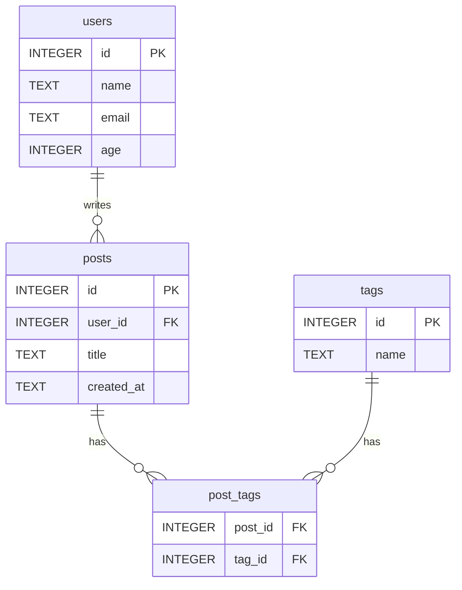

# 第15章 SQLとデータベース設計

> **この章のゴール**：SQLite を使って、テーブルの作成からデータの追加・検索・更新・削除、結合、集計までを SQL で書けるようになります。インデックス・トランザクション・正規化の考え方を理解し、プレースホルダで SQL インジェクションを防げるようになります。
> **目安時間**：読む 4時間 ＋ 演習 10時間
> **前提**：第14章まで

## この章で学ぶこと

- データベースとテーブルの関係を説明し、SQLite で `CREATE TABLE` を書ける
- `INSERT` / `SELECT` / `UPDATE` / `DELETE` と、`WHERE` / `ORDER BY` / `LIMIT` を使いこなせる
- `JOIN` で複数のテーブルをつなぎ、`COUNT` や `GROUP BY` で集計できる
- インデックスの役割を説明し、`EXPLAIN QUERY PLAN` で使われているか確かめられる
- トランザクションで「全部成功か、全部なかったことにするか」を保証できる
- 正規化の考え方で表を分け、ER 図を描き、プレースホルダで SQL インジェクションを防げる

## この章の位置づけ

第14章で作ったフレームワークには、まだ「データを覚えておく場所」がありません。サーバを止めると、配列に入れたユーザーは消えてしまいます。データを長く安全に保存し、素早く探し出すための専門の道具が**データベース**です。

次の第16章では、Ruby からデータベースを扱う部品（ORM）を自作します。その前に、この章でデータベースの言葉である **SQL** そのものを、しっかり身に付けます。ORM を使っても、最後に実行されるのは SQL です。SQL が読めないと、遅い画面や間違ったデータの原因を探せません。

この章では Ruby をほとんど書きません。ターミナルで SQL を打ち、結果を見ることを繰り返します。作業フォルダは `~/workspace/ch15-sql/` です。

## データベースとは

### 表で考える

データベースは、整理された**表の集まり**だと考えてください。表計算ソフトのシートに近いものです。

| id | name | email | age |
|---|---|---|---|
| 1 | Alice | alice@example.com | 25 |
| 2 | Bob | bob@example.com | 31 |

- 表のことを**テーブル**と呼びます
- 縦の列を**カラム**（列）と呼びます。`name` や `email` です
- 横の1行を**レコード**（行）と呼びます。1人分のユーザーです

表計算ソフトとの大きな違いは、**カラムごとに型や制約を決められる**ことです。「`email` は空にできない」「`email` は他の人と重複できない」といった約束を、データベース自身が守らせてくれます。人間がうっかり変なデータを入れようとしても、拒否してくれるのです。

このように表でデータを管理するデータベースを、**リレーショナルデータベース**（RDB）と呼びます。MySQL、PostgreSQL、SQLite などが代表です。どれも SQL という共通の言葉で操作します。

### SQLite を使う理由

この章では **SQLite** を使います。SQLite は、データベース全体を1つのファイルに保存する、小さな RDB です。サーバを別に起動する必要がなく、ファイルを作るだけで使い始められます。学習にはぴったりです。

実務の Web アプリでは、PostgreSQL や MySQL を使うことが多いです。それでも SQL の基本は共通なので、ここで学んだことはそのまま使えます。

## SQLite を起動する

### インストールの確認

```bash
sqlite3 --version
```

```
3.43.2 2023-10-10 13:08:14 1b37c146ee9ebb7acd0160c0ab1fd11017a419fa8a3187386ed8cb32b709aapl (64-bit)
```

バージョン番号が表示されればOKです（番号は環境で違います）。表示されない場合、macOS なら `brew install sqlite`、WSL（Ubuntu）なら `sudo apt-get install sqlite3` で入れます。

### データベースファイルを開く

```bash
mkdir -p ~/workspace/ch15-sql/db
cd ~/workspace/ch15-sql
sqlite3 db/practice.sqlite3
```

```
SQLite version 3.43.2 2023-10-10 13:08:14
Enter ".help" for usage hints.
sqlite>
```

`sqlite>` というプロンプトが出たら、SQL を受け付ける状態です。ファイル `db/practice.sqlite3` がなければ、新しく作られます。

最初に、結果を見やすくする設定を2つ入れます。

```
sqlite> .headers on
sqlite> .mode column
```

`.` で始まる命令は SQL ではなく、sqlite3 コマンド自身への指示です（ドットコマンド）。`.headers on` は列名を表示する、`.mode column` は列をそろえて表示する、という意味です。終了するときは `.quit` と打ちます。

SQL の文は、**最後にセミコロン `;` を付けて**初めて実行されます。`;` を忘れて Enter を押すと、`...>` という続きの入力待ちになります。慌てずに `;` を打って Enter を押してください。

## テーブルを作る：CREATE TABLE

```sql
CREATE TABLE users (
  id    INTEGER PRIMARY KEY,
  name  TEXT    NOT NULL,
  email TEXT    NOT NULL UNIQUE,
  age   INTEGER
);
```

1行ずつ見ていきます。

- `CREATE TABLE users (...)`：`users` という名前のテーブルを作る
- `id INTEGER PRIMARY KEY`：`id` は整数で、**主キー**。主キーは「この行を一意に指す番号」です。SQLite では、値を指定しなければ自動で番号が振られます
- `name TEXT NOT NULL`：`name` は文字列で、空（NULL）にできない
- `email TEXT NOT NULL UNIQUE`：`email` は空にできず、**他の行と重複できない**
- `age INTEGER`：`age` は整数で、空でもよい

**NULL** は「値がない」という特別な状態です。0 や空文字 `""` とは違います。「年齢は未登録」を表すのが NULL です。

作ったテーブルは、ドットコマンドで確かめられます。

```
sqlite> .tables
users
sqlite> .schema users
CREATE TABLE users (
  id    INTEGER PRIMARY KEY,
  name  TEXT    NOT NULL,
  email TEXT    NOT NULL UNIQUE,
  age   INTEGER
);
```

SQL のキーワード（`CREATE`、`TABLE` など）は小文字で書いても動きます。この教材では、読みやすさのためにキーワードを大文字、テーブル名やカラム名を小文字で書きます。実務でもよく使われる習慣です。

## データを入れる：INSERT

```sql
INSERT INTO users (name, email, age) VALUES ('Alice', 'alice@example.com', 25);
INSERT INTO users (name, email, age) VALUES ('Bob', 'bob@example.com', 31);
INSERT INTO users (name, email, age) VALUES ('Carol', 'carol@example.com', 19);
INSERT INTO users (name, email) VALUES ('Dave', 'dave@example.com');
```

`INSERT INTO テーブル名 (カラム名, ...) VALUES (値, ...)` という形です。カラム名と値は、同じ順番で対応します。`id` は書いていないので、自動で 1、2、3、4 と振られます。Dave は `age` を指定していないので NULL になります。

文字列は**シングルクォート `'` で囲みます**。ダブルクォート `"` ではありません。これは SQL の決まりです。

演習で使うデータは、必ずダミーにします。名前は架空のもの、メールアドレスは `example.com` を使います。`example.com` は、例示のために予約されたドメインです。

### 制約が守ってくれる

すでにある `alice@example.com` で、もう1人登録しようとすると、どうなるでしょう。

```sql
INSERT INTO users (name, email, age) VALUES ('Alice2', 'alice@example.com', 40);
```

```
Runtime error: UNIQUE constraint failed: users.email (19)
```

`UNIQUE` 制約のおかげで、拒否されました。`name` を省略しても拒否されます。

```sql
INSERT INTO users (email) VALUES ('nobody@example.com');
```

```
Runtime error: NOT NULL constraint failed: users.name (19)
```

アプリのコードでも入力チェックはします。それでも、データベースの制約は「最後の砦」として大切です。アプリにバグがあっても、別のプログラムから書き込まれても、おかしなデータを入れさせません。

## データを読む：SELECT

### 全部読む

```sql
SELECT * FROM users;
```

```
id  name   email              age
--  -----  -----------------  ---
1   Alice  alice@example.com  25 
2   Bob    bob@example.com    31 
3   Carol  carol@example.com  19 
4   Dave   dave@example.com      
```

`*` は「すべてのカラム」という意味です。Dave の `age` は NULL なので空欄です。

`.mode column` を設定していないと、`1|Alice|alice@example.com|25` のように `|` 区切りで表示されます。中身は同じです。

### カラムを選ぶ

```sql
SELECT name, age FROM users;
```

```
name   age
-----  ---
Alice  25 
Bob    31 
Carol  19 
Dave      
```

実務では `*` より、必要なカラムを並べることが多いです。読むデータが減るので速くなり、何を使っているかもコードから分かります。

### WHERE で絞り込む

```sql
SELECT * FROM users WHERE age >= 20;
```

```
id  name   email              age
--  -----  -----------------  ---
1   Alice  alice@example.com  25 
2   Bob    bob@example.com    31 
```

`WHERE` の後ろに条件を書くと、条件に合う行だけが返ります。比較には `=`、`<>`（等しくない）、`<`、`>`、`<=`、`>=` を使います。条件は `AND` や `OR` でつなげます。

```sql
SELECT name, age FROM users WHERE age >= 20 AND age < 30;
```

```
name   age
-----  ---
Alice  25 
```

Ruby の `==` と違い、SQL の「等しい」は `=` が1つです。

### NULL の落とし穴

年齢が未登録の人を探します。直感的に `= NULL` と書くと、こうなります。

```sql
SELECT * FROM users WHERE age = NULL;
```

何も表示されません。Dave は NULL なのに、見つかりませんでした。

SQL では、NULL との比較は「真」でも「偽」でもない「不明」になります。「値が分からないものと比べても、等しいかどうかは分からない」という考え方です。NULL を探すときは、専用の `IS NULL` を使います。

```sql
SELECT * FROM users WHERE age IS NULL;
```

```
id  name  email             age
--  ----  ----------------  ---
4   Dave  dave@example.com     
```

逆は `IS NOT NULL` です。これは SQL 初心者が必ず一度はつまずく点です。覚えておいてください。

### 部分一致：LIKE

```sql
SELECT name FROM users WHERE name LIKE '%o%';
```

```
name 
-----
Bob  
Carol
```

`%` は「0文字以上の何か」を表します。`'%o%'` は「どこかに o を含む」という意味です。`'A%'` なら「A で始まる」です。

### 並べ替え：ORDER BY

```sql
SELECT name, age FROM users ORDER BY age DESC;
```

```
name   age
-----  ---
Bob    31 
Alice  25 
Carol  19 
Dave      
```

`ORDER BY カラム名` で並べ替えます。`ASC` は小さい順（省略時の既定）、`DESC` は大きい順です。SQLite では、NULL は小さい値として扱われるので、`DESC` では最後に来ました。

**`ORDER BY` を書かないと、行の順番は保証されません。** たまたま id 順に見えても、それは約束ではありません。順番が大事な画面では、必ず `ORDER BY` を書きます。

### 件数を制限する：LIMIT と OFFSET

```sql
SELECT name, age FROM users WHERE age IS NOT NULL ORDER BY age DESC LIMIT 2;
```

```
name   age
-----  ---
Bob    31 
Alice  25 
```

`LIMIT 2` は「最初の2件だけ」です。「年齢が高い順に上位2人」が取れました。

```sql
SELECT id, name FROM users ORDER BY id LIMIT 2 OFFSET 2;
```

```
id  name 
--  -----
3   Carol
4   Dave 
```

`OFFSET 2` は「最初の2件を飛ばす」です。1ページ2件の一覧で、2ページ目を表示するときの形です。これを**ページネーション**と呼びます。

句の順番は決まっています。`SELECT → FROM → WHERE → ORDER BY → LIMIT` の順に書きます。

## データを変える：UPDATE と DELETE

### UPDATE

```sql
UPDATE users SET age = 26 WHERE id = 1;
SELECT changes();
SELECT id, name, age FROM users WHERE id = 1;
```

```
changes()
---------
1        
id  name   age
--  -----  ---
1   Alice  26 
```

`UPDATE テーブル名 SET カラム = 値 WHERE 条件` という形です。`changes()` は、直前の文で変わった行数を返す SQLite の関数です。1行だけ変わったことが確かめられます。

### DELETE

```sql
DELETE FROM users WHERE id = 4;
SELECT changes();
SELECT id, name FROM users;
```

```
changes()
---------
1        
id  name 
--  -----
1   Alice
2   Bob  
3   Carol
```

### WHERE を忘れると全部変わる

ここは本当に危険なので、はっきり書きます。

**`UPDATE` と `DELETE` で `WHERE` を書き忘れると、すべての行が対象になります。** `DELETE FROM users;` と打てば、確認なしに全ユーザーが消えます。元に戻す「ゴミ箱」はありません。

実務で `UPDATE` や `DELETE` を手で実行するときは、次の手順を守ります。

1. 同じ `WHERE` で、まず `SELECT` を実行する
2. 対象の行と件数が想定どおりか確かめる
3. `SELECT ... FROM` の部分を `UPDATE` や `DELETE` に書き換えて実行する
4. `changes()` などで、変わった件数が想定どおりか確かめる

後で学ぶトランザクションを使えば、間違えたときに取り消すこともできます。

## 複数のテーブルをつなぐ：JOIN

### 投稿のテーブルを作る

ユーザーが記事を投稿するアプリを考えます。投稿は別のテーブルにします。

```sql
PRAGMA foreign_keys = ON;

CREATE TABLE posts (
  id         INTEGER PRIMARY KEY,
  user_id    INTEGER NOT NULL REFERENCES users(id),
  title      TEXT    NOT NULL,
  created_at TEXT    NOT NULL
);

INSERT INTO posts (user_id, title, created_at) VALUES
  (1, 'Hello SQLite', '2026-04-01'),
  (1, 'Learning JOIN', '2026-04-03'),
  (2, 'Rack memo',    '2026-04-02');
```

`user_id` は「この投稿を書いたユーザーの id」です。このように、他のテーブルの主キーを指すカラムを**外部キー**と呼びます。`REFERENCES users(id)` は「この値は users の id に存在しなければならない」という制約です。

SQLite では、外部キーの制約を効かせるには `PRAGMA foreign_keys = ON;` が必要です。この設定は接続ごとなので、sqlite3 を起動するたびに打ちます。他のデータベースでは、最初から有効なのが普通です。

存在しないユーザーの投稿を入れようとすると、拒否されます。

```sql
INSERT INTO posts (user_id, title, created_at) VALUES (999, 'ghost', '2026-04-05');
```

```
Runtime error: FOREIGN KEY constraint failed (19)
```

複数行を一度に入れるときは、`VALUES` の後ろに `( ... ), ( ... )` とカンマで並べます。日付はここでは `'2026-04-01'` のような文字列で入れています。この形式なら、文字列として並べても日付順になります。

### INNER JOIN

「投稿のタイトルと、書いた人の名前」を一緒に表示したいとします。名前は `users` に、タイトルは `posts` にあります。2つの表をつなぐのが `JOIN` です。

```sql
SELECT users.name, posts.title
FROM posts
INNER JOIN users ON users.id = posts.user_id;
```

```
name   title        
-----  -------------
Alice  Hello SQLite 
Alice  Learning JOIN
Bob    Rack memo    
```

`ON users.id = posts.user_id` が「どの行とどの行をつなぐか」の条件です。投稿の `user_id` と、ユーザーの `id` が等しい組み合わせを作っています。`テーブル名.カラム名` と書くと、どちらの表のカラムかを明示できます。

毎回テーブル名を書くのは長いので、**別名**（エイリアス）を付けるのが普通です。

```sql
SELECT u.name, p.title
FROM posts AS p
JOIN users AS u ON u.id = p.user_id
ORDER BY p.created_at;
```

```
name   title        
-----  -------------
Alice  Hello SQLite 
Bob    Rack memo    
Alice  Learning JOIN
```

`INNER` は省略できます。`JOIN` とだけ書けば `INNER JOIN` です。

### LEFT JOIN

`INNER JOIN` は、**両方の表に相手がいる行だけ**を返します。投稿のない Carol は出てきません。「投稿がない人も含めて、全員を表示したい」ときは `LEFT JOIN` を使います。

```sql
SELECT u.name, p.title
FROM users AS u
LEFT JOIN posts AS p ON p.user_id = u.id
ORDER BY u.id, p.id;
```

```
name   title        
-----  -------------
Alice  Hello SQLite 
Alice  Learning JOIN
Bob    Rack memo    
Carol               
```

`LEFT JOIN` は「左の表（`FROM` に書いた表）の行は全部残す。右の表に相手がいなければ NULL で埋める」という意味です。Carol の `title` は NULL になりました。

どちらを使うかは、「相手がいない行を結果に含めたいか」で決めます。

## 集計する：COUNT と GROUP BY

### 数を数える

```sql
SELECT COUNT(*) FROM posts;
```

```
COUNT(*)
--------
3       
```

他にも、合計の `SUM`、平均の `AVG`、最小の `MIN`、最大の `MAX` があります。

```sql
SELECT AVG(age), MIN(age), MAX(age), SUM(age) FROM users;
```

```
AVG(age)          MIN(age)  MAX(age)  SUM(age)
----------------  --------  --------  --------
25.3333333333333  19        31        76      
```

集計関数は NULL を無視します。

### グループごとに数える

「ユーザーごとの投稿数」を出します。

```sql
SELECT u.name, COUNT(p.id) AS post_count
FROM users AS u
LEFT JOIN posts AS p ON p.user_id = u.id
GROUP BY u.id
ORDER BY post_count DESC;
```

```
name   post_count
-----  ----------
Alice  2         
Bob    1         
Carol  0         
```

`GROUP BY u.id` は「ユーザーごとにグループを作り、グループごとに集計する」という意味です。`AS post_count` は、結果の列に名前を付けています。

ここに大事な落とし穴があります。`COUNT(p.id)` を `COUNT(*)` にすると、こうなります。

```sql
SELECT u.name, COUNT(*) AS wrong_count
FROM users AS u
LEFT JOIN posts AS p ON p.user_id = u.id
GROUP BY u.id;
```

```
name   wrong_count
-----  -----------
Alice  2          
Bob    1          
Carol  1          
```

投稿のない Carol が 1 になりました。`LEFT JOIN` で Carol の行は「title が NULL の1行」として残ります。`COUNT(*)` は行の数を数えるので、その1行を数えてしまったのです。`COUNT(p.id)` は「NULL でない `p.id` の数」なので、正しく 0 になります。

### グループを絞り込む：HAVING

「2件以上投稿しているユーザー」だけを出したいとします。

```sql
SELECT user_id, COUNT(*) AS post_count
FROM posts
GROUP BY user_id
HAVING COUNT(*) >= 2;
```

```
user_id  post_count
-------  ----------
1        2         
```

`WHERE` は**グループを作る前**の行を絞り込みます。`HAVING` は**集計した後**のグループを絞り込みます。集計結果を条件に使うときは `HAVING` です。

## インデックス：探すのを速くする

### 本の索引と同じ

分厚い本で「トランザクション」という言葉を探すとき、最初のページから全部読む人はいません。巻末の**索引**を見て、ページ番号に飛びます。

データベースの**インデックス**も同じです。インデックスがないと、データベースは全部の行を順番に調べます。これを**フルスキャン**と呼びます。インデックスがあれば、目的の行に素早くたどり着けます。

### EXPLAIN QUERY PLAN で確かめる

データベースがどうやって探すつもりかは、`EXPLAIN QUERY PLAN` を前に付けると見られます。

```sql
EXPLAIN QUERY PLAN SELECT * FROM users WHERE email = 'bob@example.com';
```

```
QUERY PLAN
`--SEARCH users USING INDEX sqlite_autoindex_users_1 (email=?)
```

```sql
EXPLAIN QUERY PLAN SELECT * FROM users WHERE age = 31;
```

```
QUERY PLAN
`--SCAN users
```

- `SEARCH ... USING INDEX`：インデックスを使って探す（速い）
- `SCAN`：全部の行を順に調べる（行が多いと遅い）

`email` には `UNIQUE` を付けたので、SQLite が自動でインデックス（`sqlite_autoindex_users_1`）を作っていました。重複を素早く確かめるためです。`age` にはインデックスがないので `SCAN` です。主キーで探すと、こう出ます。

```sql
EXPLAIN QUERY PLAN SELECT * FROM users WHERE id = 2;
```

```
QUERY PLAN
`--SEARCH users USING INTEGER PRIMARY KEY (rowid=?)
```

### インデックスを作る

投稿をユーザーで絞り込む `WHERE user_id = 1` は、よく使いそうです。今はどうでしょう。

```sql
EXPLAIN QUERY PLAN SELECT * FROM posts WHERE user_id = 1;
```

```
QUERY PLAN
`--SCAN posts
```

インデックスを作ります。

```sql
CREATE INDEX index_posts_on_user_id ON posts(user_id);
EXPLAIN QUERY PLAN SELECT * FROM posts WHERE user_id = 1;
```

```
QUERY PLAN
`--SEARCH posts USING INDEX index_posts_on_user_id (user_id=?)
```

`SCAN` が `SEARCH ... USING INDEX` に変わりました。`index_テーブル名_on_カラム名` という名前の付け方は、Rails の慣習に合わせています。

### どれくらい速くなるか

3行では違いが分かりません。100万行のテーブルで試した結果を示します（別のデータベースファイルで行いました）。`.timer on` は、実行時間を表示するドットコマンドです。

```sql
CREATE TABLE logs (id INTEGER PRIMARY KEY, user_id INTEGER, message TEXT);
WITH RECURSIVE n(i) AS (SELECT 1 UNION ALL SELECT i + 1 FROM n WHERE i < 1000000)
INSERT INTO logs (user_id, message) SELECT i % 10000, 'log ' || i FROM n;
.timer on
SELECT COUNT(*) FROM logs WHERE user_id = 42;
CREATE INDEX index_logs_on_user_id ON logs(user_id);
SELECT COUNT(*) FROM logs WHERE user_id = 42;
```

```
100
Run Time: real 0.042 user 0.036259 sys 0.005372
Run Time: real 0.302 user 0.236405 sys 0.059281
100
Run Time: real 0.000 user 0.000057 sys 0.000030
```

2行目の `WITH RECURSIVE ...` は、1から100万までの番号を作ってダミーの行を入れる書き方です。今は「大量の行を入れている」とだけ分かれば十分です。

インデックスなしでは 0.042秒、インデックスありでは 0.000秒（1ミリ秒未満）でした。間の 0.302秒は、インデックスを作るのにかかった時間です。

### インデックスは万能ではない

それならすべてのカラムに作ればよいかというと、違います。

- **書き込みが遅くなる**：行を追加・更新するたびに、インデックスも更新する必要がある
- **容量を使う**：インデックスも、データベースファイルの中に保存される
- **使われない検索もある**：`LIKE '%bob%'` のように先頭が `%` の検索は、インデックスを使えない

最後の点を確かめます。

```sql
EXPLAIN QUERY PLAN SELECT * FROM users WHERE email LIKE '%bob%';
```

```
QUERY PLAN
`--SCAN users
```

索引で「途中に bob を含む言葉」は探せないのと同じです。インデックスは「よく使う検索条件」と「外部キー」に作り、`EXPLAIN QUERY PLAN` で効いているか確かめる。これが基本の考え方です。

## トランザクション：全部か、何もなしか

### 途中で失敗すると困る

銀行の振込を考えます。Alice から Bob へ 300円送るには、2つの更新が必要です。

1. Alice の残高を 300 減らす
2. Bob の残高を 300 増やす

1が成功して2が失敗したら、300円が消えてしまいます。逆なら、300円が湧いてきます。どちらも許されません。

**トランザクション**は、複数の操作を「ひとまとまり」にする仕組みです。全部成功したら確定（**コミット**）し、途中で問題があれば全部を取り消します（**ロールバック**）。

試すために、口座のテーブルを作ります。`CHECK` は「この条件を満たさない値は入れさせない」という制約です。

```sql
CREATE TABLE accounts (
  id      INTEGER PRIMARY KEY,
  owner   TEXT    NOT NULL,
  balance INTEGER NOT NULL CHECK (balance >= 0)
);
INSERT INTO accounts (owner, balance) VALUES ('Alice', 1000), ('Bob', 500);
```

### ROLLBACK で取り消す

```sql
BEGIN;
UPDATE accounts SET balance = balance - 300 WHERE owner = 'Alice';
SELECT * FROM accounts;
ROLLBACK;
SELECT * FROM accounts;
```

```
id  owner  balance
--  -----  -------
1   Alice  700    
2   Bob    500    
id  owner  balance
--  -----  -------
1   Alice  1000   
2   Bob    500    
```

`BEGIN` でトランザクションを始めます。途中の `SELECT` では Alice が 700 になっています。`ROLLBACK` すると、`BEGIN` の時点に戻りました。

### COMMIT で確定する

```sql
BEGIN;
UPDATE accounts SET balance = balance - 300 WHERE owner = 'Alice';
UPDATE accounts SET balance = balance + 300 WHERE owner = 'Bob';
COMMIT;
SELECT * FROM accounts;
```

```
id  owner  balance
--  -----  -------
1   Alice  700    
2   Bob    800    
```

2つの更新がそろって確定しました。

### トランザクションがないとどうなるか

Alice の残高（700）を超える 5000円を送ろうとします。順番は「Bob を増やす → Alice を減らす」です。まず、トランザクションなしで実行します。

```sql
UPDATE accounts SET balance = balance + 5000 WHERE owner = 'Bob';
UPDATE accounts SET balance = balance - 5000 WHERE owner = 'Alice';
SELECT * FROM accounts;
```

```
Runtime error: CHECK constraint failed: balance >= 0 (19)
id  owner  balance
--  -----  -------
1   Alice  700    
2   Bob    5800   
```

Alice の更新は `CHECK` 制約で拒否されました。ところが Bob の更新はもう確定しています。5000円が湧いてきてしまいました。

（この実験をした人は、`UPDATE accounts SET balance = 800 WHERE owner = 'Bob';` で Bob を元に戻してから先に進んでください。）

同じことを、トランザクションの中で行います。

```sql
BEGIN;
UPDATE accounts SET balance = balance + 5000 WHERE owner = 'Bob';
UPDATE accounts SET balance = balance - 5000 WHERE owner = 'Alice';
SELECT * FROM accounts;
ROLLBACK;
SELECT * FROM accounts;
```

```
Runtime error: CHECK constraint failed: balance >= 0 (19)
id  owner  balance
--  -----  -------
1   Alice  700    
2   Bob    5800   
id  owner  balance
--  -----  -------
1   Alice  700    
2   Bob    800    
```

注目してほしい点があります。エラーの直後の `SELECT` では、Bob はまだ 5800 です。**エラーが起きても、トランザクション全体が自動で取り消されるわけではありません。** 失敗した文だけが無効になり、トランザクションは続いています。だから、エラーに気づいたら自分で `ROLLBACK` する必要があります。`ROLLBACK` の後、Bob は 800 に戻りました。

プログラムからトランザクションを使うときは、「例外が起きたら必ずロールバックする」という形で書きます。Rails の `transaction do ... end` は、ブロックの中で例外が起きると自動でロールバックしてくれます。

## 正規化：表をどう分けるか

### 1つの表に全部入れると何が起きるか

投稿と著者の情報を、1つの表に入れてみます。

```sql
CREATE TABLE posts_flat (id INTEGER PRIMARY KEY, title TEXT, author_name TEXT, author_email TEXT);
INSERT INTO posts_flat (title, author_name, author_email) VALUES
  ('Hello SQLite', 'Alice', 'alice@example.com'),
  ('Learning JOIN', 'Alice', 'alice@example.com'),
  ('Rack memo', 'Bob', 'bob@example.com');
```

一見、分かりやすい表です。Alice がメールアドレスを変えたとします。1行目だけ更新してしまいました。

```sql
UPDATE posts_flat SET author_email = 'alice@example.net' WHERE id = 1;
SELECT DISTINCT author_name, author_email FROM posts_flat;
```

```
author_name  author_email     
-----------  -----------------
Alice        alice@example.net
Alice        alice@example.com
Bob          bob@example.com  
```

`DISTINCT` は重複を除く指定です。Alice のメールアドレスが2つになりました。どちらが正しいか、もう分かりません。

同じ情報が複数の場所にあると、こうした**不整合**が起きます。他にも困ることがあります。

- 投稿していないユーザーを登録できない（投稿の行がないと、ユーザーの情報を置く場所がない）
- Alice の投稿を全部消すと、Alice のメールアドレスも消える

### 正規化とは

**正規化**は、「1つの事実は1か所にだけ書く」ように表を分けることです。さきほどの例なら、ユーザーの情報は `users` に、投稿の情報は `posts` に置き、`posts.user_id` でつなぎます。これが最初に作った形です。メールアドレスは `users` の1か所にしかないので、更新は1回で済み、食い違いは起きません。

正規化には「第1正規形」「第2正規形」「第3正規形」という段階がありますが、最初は次の3つの目安で十分です。

1. **1つのマスには1つの値だけ**：`tags` カラムに `'ruby,sql'` のようにカンマ区切りで複数入れない
2. **同じ情報を何度も書かない**：同じ値が何行にも繰り返し出てきたら、別の表に分けられないか考える
3. **その表の主役についての情報だけを置く**：投稿の表に「著者のメールアドレス」は置かない。それは著者についての情報だから

### 多対多は中間テーブルで表す

1つの投稿に複数のタグを付け、1つのタグが複数の投稿に付く。このような関係を**多対多**と呼びます。1つのマスに複数の値を入れないとすると、どう表せばよいでしょう。答えは、**関係そのものを表す表**（中間テーブル）を作ることです。

```sql
CREATE TABLE tags (
  id   INTEGER PRIMARY KEY,
  name TEXT NOT NULL UNIQUE
);

CREATE TABLE post_tags (
  post_id INTEGER NOT NULL REFERENCES posts(id),
  tag_id  INTEGER NOT NULL REFERENCES tags(id),
  PRIMARY KEY (post_id, tag_id)
);

INSERT INTO tags (name) VALUES ('ruby'), ('sql'), ('memo');
INSERT INTO post_tags (post_id, tag_id) VALUES (1, 2), (2, 2), (3, 1), (3, 3);
```

`post_tags` の1行は「投稿 X にタグ Y が付いている」という1つの事実です。`PRIMARY KEY (post_id, tag_id)` は、2つの組み合わせで行を一意にする指定で、同じタグを二重に付けるのを防ぎます。2回 JOIN すれば、投稿とタグを並べられます。

```sql
SELECT p.title, t.name AS tag
FROM posts AS p
JOIN post_tags AS pt ON pt.post_id = p.id
JOIN tags AS t ON t.id = pt.tag_id
ORDER BY p.id, t.name;
```

```
title          tag 
-------------  ----
Hello SQLite   sql 
Learning JOIN  sql 
Rack memo      memo
Rack memo      ruby
```

### 正規化しすぎない

正規化を進めると、表が増え、JOIN が増えます。読み込みが重くなることもあります。そのため実務では、速さのためにあえて同じ情報を2か所に持つことがあります（**非正規化**）。たとえば「投稿数」を `users` に持っておく、などです。ただしそれは、正規化した形を理解したうえで、理由を持って崩すものです。最初は正規化した形から考えてください。

## ER 図を描く

### ER 図とは

テーブルが増えると、どの表がどの表とつながっているか、頭の中だけでは追えなくなります。**ER 図**（Entity Relationship Diagram、実体関連図）は、テーブルとその関係を絵にしたものです。設計の相談やレビューで、チームの共通の地図になります。

ER 図で表すのは次の3つです。

- **エンティティ**：テーブル（箱で描く）
- **属性**：カラム（箱の中に書く）
- **リレーション**：テーブル同士の関係と、その数（線で描く）

### 関係の「数」を読む

関係の数（**カーディナリティ**）は、次の3種類が基本です。

- **1対1**：1人のユーザーに、1つのプロフィール
- **1対多**：1人のユーザーに、複数の投稿（投稿から見ると、書いた人は1人）
- **多対多**：投稿とタグ。中間テーブルで「1対多」2つに分解する

### Mermaid で描く

手書きでも、図を描くツールでも構いません。おすすめは、文字で書けて GitHub でも図として表示される **Mermaid** です。この章のテーブルは、こう書けます。



`||--o{` の記号は「鳥の足（クロウズフット）記法」と呼ばれます。線の端の形で数を表します。

| 記号 | 意味 |
|---|---|
| `\|\|` | ちょうど1つ |
| `o{` | 0個以上（多） |
| `\|{` | 1個以上 |
| `o\|` | 0か1つ |

`users ||--o{ posts` は「ユーザー1人に対して、投稿は0個以上」と読みます。`PK` は主キー、`FK` は外部キーの印です。

ER 図は、テーブルを作る**前**に描くのが理想です。SQL を書いてから気づく設計の誤りは、直すのに手間がかかります。図の段階なら、消しゴム1つで直せます。

## SQL インジェクションとプレースホルダ

### アプリから SQL を組み立てるとき

ここまでは、自分で SQL を手で打ってきました。Web アプリでは、利用者の入力を使って SQL を組み立てます。たとえば検索フォームに入力された名前で探す場合です。

Ruby からは `sqlite3` という Gem で SQLite を使えます。Gemfile に `gem "sqlite3"` を書いて `bundle install` します。次の例は、入力を文字列の中に埋め込んで SQL を作っています。**これは危険な書き方の見本です。**

```ruby
require "sqlite3"

db = SQLite3::Database.new(":memory:")
db.execute("CREATE TABLE users (id INTEGER PRIMARY KEY, name TEXT NOT NULL, email TEXT NOT NULL)")
db.execute("INSERT INTO users (name, email) VALUES (?, ?)", ["Alice", "alice@example.com"])
db.execute("INSERT INTO users (name, email) VALUES (?, ?)", ["Bob", "bob@example.com"])
db.execute("INSERT INTO users (name, email) VALUES (?, ?)", ["O'Reilly", "oreilly@example.com"])

input = "' OR '1'='1"

# NG: 入力を文字列に埋め込む
sql = "SELECT id, name FROM users WHERE name = '#{input}'"
puts sql
p db.execute(sql)
```

```
SELECT id, name FROM users WHERE name = '' OR '1'='1'
[[1, "Alice"], [2, "Bob"], [3, "O'Reilly"]]
```

`":memory:"` は、ファイルを作らずメモリの上だけにデータベースを作る指定です。実験やテストに便利です。

入力 `' OR '1'='1` の最初の `'` が、SQL の文字列を閉じてしまいました。その後ろの `OR '1'='1'` は、**SQL の命令として**解釈されます。`'1'='1'` は常に真なので、全員が返ってきました。

これが **SQL インジェクション**です。入力された文字列が、データではなく命令として実行されてしまう脆弱性です。第14章の XSS と同じ構造で、行き先が HTML か SQL かの違いです。

削除ではもっと深刻です。

```ruby
id = "1 OR 1=1" # 本来は "1" のような ID が来るはずの入力

db.execute("DELETE FROM users WHERE id = #{id}")      # NG
p db.execute("SELECT COUNT(*) FROM users")
```

```
[[0]]
```

1件消すつもりが、全員が消えました。

### プレースホルダでバインドする

対策は、**値を SQL の文字列に埋め込まず、別に渡す**ことです。SQL の中の値を入れる場所に `?` を書き、値は配列で渡します。この `?` を**プレースホルダ**、値を渡すことを**バインド**と呼びます。

```ruby
# OK: プレースホルダで値をバインドする
p db.execute("SELECT id, name FROM users WHERE name = ?", [input])
p db.execute("SELECT id, name FROM users WHERE name = ?", ["O'Reilly"])
```

```
[]
[[3, "O'Reilly"]]
```

攻撃の文字列は「`' OR '1'='1` という名前の人」として扱われ、該当者なしになりました。`O'Reilly` のように引用符を含む正当な名前も、正しく検索できます。

なぜ安全なのでしょう。プレースホルダを使うと、データベースはまず `?` 付きの SQL の**形**を解釈し、その後で値を当てはめます。値が入るのは形が決まった後なので、値の中に何が書いてあっても、命令として解釈されることはありません。型紙に布をはめ込むようなもので、布の柄で型紙の形は変わりません。

削除も同じです。

```ruby
id = "1 OR 1=1"
db.execute("DELETE FROM users WHERE id = ?", [id])  # OK
p db.execute("SELECT COUNT(*) FROM users")
p db.changes
```

```
[[3]]
0
```

1行も消えませんでした。

sqlite3 コマンドの中でも、プレースホルダを試せます。`.param set` で値を設定し、SQL の中では `:name` のように名前で参照します。

```
sqlite> .param set :name "' OR '1'='1"
sqlite> SELECT id, name FROM users WHERE name = :name;
sqlite> .param set :name Bob
sqlite> SELECT id, name FROM users WHERE name = :name;
id  name
--  ----
2   Bob 
```

1つ目の `SELECT` は何も返しません。攻撃の文字列が、ただの値として扱われたからです。

### 自前のエスケープはしない

「入力の `'` を `''` に置き換えれば安全では」と考える人がいます。やめてください。文字コードやデータベースごとの細かな違いで、すり抜ける方法が見つかってきた歴史があります。**値は必ずプレースホルダでバインドする**。これが唯一の答えです。

### バインドできないもの

プレースホルダで渡せるのは「値」だけです。テーブル名、カラム名、`ASC` / `DESC` のような SQL の構造の一部はバインドできません。たとえば `ORDER BY ?` に `"name"` を渡しても、カラム名としては扱われず、ただの文字列定数で並べ替えることになります。

並べ替えるカラムを利用者に選ばせたい場合は、**許可リスト**を使います。「`name` か `created_at` のどちらかなら使う。それ以外は拒否する」というように、受け付ける値をコードで決めておきます。入力をそのまま SQL に入れることは、どんな場合もしません。

### バリデーションとの違い

「ID は数字だけ」という入力チェック（**バリデーション**）も大切です。しかし、これは業務上のルールを守らせるためのものです。SQL インジェクションの対策は、あくまでプレースホルダです。チェックを書き忘れた場所や、チェックのすり抜けがあっても安全であるように、両方を行います。

## 実務ではこうなる

**ORM の裏で何が起きているかを読みます。** Rails の Active Record は、`User.where(name: "Alice")` を `SELECT ... WHERE name = ?` のような SQL に変換し、値をバインドして実行します。開発中のログには、実行された SQL がそのまま出ます。画面が遅いとき、まずこのログを見て、同じような SQL が何十回も出ていないか（N+1 問題、第18章）、インデックスが効いているかを確かめます。`EXPLAIN` はそのための道具です。

**本番のデータを直接変える作業は、儀式のように慎重に行います。** 先に `SELECT` で対象を確認する。トランザクションの中で実行する。変わった件数を確かめてからコミットする。可能なら、他の人に SQL を見てもらう。ベテランほど、この手順を省きません。

**テーブルの変更は「マイグレーション」で管理します。** 実務では `CREATE TABLE` を手で打つのではなく、変更の手順をファイルに書いてコードと一緒に Git で管理します。第16章と第18章で扱います。

**ジュニアがやりがちな失敗：**

- `UPDATE` や `DELETE` の `WHERE` を書き忘れる。または、`WHERE` が想定より広い
- `= NULL` と書いて、何も見つからないことに気づかない
- `ORDER BY` を書かず、「いつもこの順番だから」と思い込む
- `LEFT JOIN` と `COUNT(*)` の組み合わせで、0件のはずが1件と数える
- 文字列連結で SQL を組み立てる。「管理画面だから」「社内向けだから」は理由にならない
- 外部キーにインデックスを付け忘れ、データが増えてから JOIN が遅くなる

## 演習

作業フォルダは `~/workspace/ch15-sql/` です。SQL は手で打つだけでなく、ファイルに保存して Git で管理してください。`schema.sql`（テーブルを作る SQL）、`seed.sql`（ダミーデータを入れる SQL）、`queries.sql`（調べる SQL）のように分けます。ファイルの SQL は `sqlite3 db/practice.sqlite3 < schema.sql` のようにして実行できます。データベースファイル自体は、作り直せる生成物なので、`.gitignore` に `db/*.sqlite3` を書いて管理対象から外します。

### 演習15-1：テーブルを作り、CRUD を一通り行う

- 題材は「読書記録」とする。`books`（id、title、author、published_year）のテーブルを `schema.sql` に書く。`title` と `author` は空にできないようにする
- `seed.sql` に、架空の本を5冊以上入れる `INSERT` を書く。1冊は `published_year` を NULL にする
- `queries.sql` に、次の SQL を書いて実行する
  - 全件を `title` の順に表示する
  - 2000年以降に出た本だけを表示する
  - `published_year` が NULL の本を表示する（`= NULL` で試した結果もメモする）
  - 新しい順に上位3冊を表示する
  - 1冊の `published_year` を `UPDATE` で直す。先に同じ `WHERE` で `SELECT` して対象を確かめる
  - 1冊を `DELETE` で消す。同じく先に `SELECT` する
- **完了条件**：
  - `rm -f db/practice.sqlite3 && sqlite3 db/practice.sqlite3 < schema.sql && sqlite3 db/practice.sqlite3 < seed.sql` が、エラーなしで何度でも実行できる
  - `title` を省略した `INSERT` が `NOT NULL constraint failed` で拒否されることを確かめ、その出力をメモしている
  - `UPDATE` と `DELETE` の後に `SELECT changes();` が `1` を返す
- ヒント：ファイルから実行するときも、見やすく表示したければファイルの先頭に `.headers on` と `.mode column` を書けます

### 演習15-2：JOIN と集計

- `reviews`（id、book_id、rating、comment、created_at）のテーブルを追加する。`book_id` は `books` の外部キーにし、`rating` は1〜5だけ入るよう `CHECK` 制約を付ける
- レビューを8件以上入れる。レビューが1件もない本を1冊以上残す
- 次の SQL を書く
  - レビューと本のタイトルを並べて表示する（`INNER JOIN`）
  - レビューのない本も含めて、全部の本とレビューを表示する（`LEFT JOIN`）
  - 本ごとのレビュー件数と平均評価を、件数の多い順に表示する。レビューのない本は件数0と表示する
  - 平均評価が4以上の本だけを表示する（`HAVING`）
- **完了条件**：
  - `rating` に 6 を入れる `INSERT` が `CHECK constraint failed` で拒否される
  - `PRAGMA foreign_keys = ON;` の後、存在しない `book_id` のレビューが `FOREIGN KEY constraint failed` で拒否される
  - レビュー件数の集計で、レビューのない本が `0` と表示される。`COUNT(*)` にすると `1` になることも確かめ、理由をメモしている

### 演習15-3：インデックスとトランザクション

- `EXPLAIN QUERY PLAN` で、`reviews` を `book_id` で絞り込む SQL の計画を確かめる
- `reviews(book_id)` にインデックスを作り、計画がどう変わったかを確かめる
- 本文の手順で、100万行のテーブルを別ファイル（`db/big.sqlite3`）に作り、インデックスの有無で `.timer on` の時間を比べる。終わったら `db/big.sqlite3` は消してよい
- 本文の `accounts` テーブルを作り、トランザクションなしで失敗させた場合と、トランザクションの中で失敗させて `ROLLBACK` した場合の結果を比べる
- **完了条件**：
  - インデックス作成の前後で、`EXPLAIN QUERY PLAN` の出力が `SCAN reviews` から `SEARCH reviews USING INDEX ...` に変わったことを、両方の出力を貼って示している
  - 100万行での時間の比較結果をメモしている
  - トランザクションの実験で、「エラーが起きた直後の `SELECT`」と「`ROLLBACK` 後の `SELECT`」の両方の出力を貼り、なぜ `ROLLBACK` が必要かを自分の言葉で書いている

### 演習15-4：正規化と ER 図

- 次の「何でも入り」の表を見て、問題点を3つ以上書く
  - `orders_flat(order_id, ordered_at, customer_name, customer_email, product_names, total_price)`
  - `product_names` には `'pen,notebook'` のようにカンマ区切りで商品名が入る
- この表を正規化し、`customers`、`orders`、`products`、`order_items` などの表に分けた `schema_shop.sql` を書く
- Mermaid で ER 図を描き、`notes/er.md` に保存する。各関係が 1対多 か 多対多 かを書き添える
- ダミーデータを入れ、「顧客ごとの注文件数」と「商品ごとの売れた個数」を出す SQL を書く
- **完了条件**：
  - `schema_shop.sql` がエラーなしで実行でき、1つのマスに複数の値を入れるカラムがない
  - `notes/er.md` の Mermaid が、GitHub のプレビューなどで図として表示される
  - 2つの集計 SQL が、手で数えた結果と一致する
- ヒント：注文1件に商品が複数あり、商品は複数の注文に出てきます。この関係は何対何でしょうか。「何個買ったか」はどの表に置くのが自然か考えてください

### 演習15-5：SQL インジェクションを防ぐ（TDD）

- `~/workspace/ch15-sql/` に Gemfile（`sqlite3`、`minitest`、`rake`）と Rakefile を用意する
- `lib/book_finder.rb` に、本を探すクラスを TDD で作る。メソッドは次の3つ
  - タイトルで完全一致検索する
  - 並べ替えのカラム名（`title` か `published_year`）を指定して全件を返す
  - id を指定して1冊削除する
- テストは毎回 `":memory:"` のデータベースを作り、ダミーデータを入れてから行う
- 先に、次の**攻撃が失敗する**テストを書いて RED を確認し、その後で実装する
- **完了条件**：次のテストがすべてあり、`bundle exec rake test` が失敗0・エラー0
  - `O'Reilly` のように `'` を含むタイトルを、1冊として正しく検索できる
  - タイトルに `' OR '1'='1` を渡しても、結果が空である
  - 削除に `"1 OR 1=1"` を渡しても、削除される行が1行以下で、他の行は残っている（件数で確かめる）
  - 並べ替えに許可リスト外の値（たとえば `"title; DROP TABLE books"`）を渡すと、例外になる（または仕様として決めた方法で拒否される）
  - `lib/book_finder.rb` の中に、`#{` で値を SQL に埋め込む箇所がない（`grep -n '#{' lib/book_finder.rb` で SQL への埋め込みが見つからない）
- ヒント：並べ替えのカラム名はバインドできません。許可リストに含まれるかを確かめたうえで、許可リストの側の文字列を使ってください。入力の文字列そのものを SQL に入れないことが大切です

## 確認クイズ

**Q1.** `SELECT * FROM users WHERE age = NULL;` が、age が NULL の行を返さないのはなぜですか。正しい書き方も答えてください。

**Q2.** 投稿が0件のユーザーを含めて「ユーザーごとの投稿数」を出したいとき、`JOIN` の種類と `COUNT` の書き方はどうすべきですか。

**Q3.** インデックスを全カラムに付けないのはなぜですか。2つ挙げてください。

**Q4.** トランザクションの中で、2つ目の `UPDATE` が制約違反でエラーになりました。1つ目の `UPDATE` の結果はどうなっていますか。どうすべきですか。

**Q5.** 「入力の中の `'` を `''` に置き換えてから SQL に埋め込むので、SQL インジェクションは防げている」。この考えの問題点は何ですか。

**Q6.** `ORDER BY` のカラムを、クエリパラメータ `?sort=name` で切り替えたい。プレースホルダ `ORDER BY ?` を使えば安全ですか。

### 解答と解説

**A1.** SQL では、NULL との比較は真でも偽でもなく「不明」になるからです。`WHERE` は真の行だけを返すので、何も返りません。正しくは `WHERE age IS NULL` と書きます。

**A2.** `users` を左にした `LEFT JOIN` を使い、`COUNT(posts.id)` のように投稿側のカラムを数えます。`INNER JOIN` だと投稿のないユーザーが消えます。`COUNT(*)` だと、NULL で埋められた1行を数えてしまい、0件が1件になります。

**A3.** 1つ目は、行の追加や更新のたびにインデックスも更新するので、書き込みが遅くなるからです。2つ目は、インデックスも容量を使うからです。また、`LIKE '%...'` のように、インデックスを使えない検索もあります。よく使う検索条件と外部キーに絞り、`EXPLAIN QUERY PLAN` で効果を確かめます。

**A4.** エラーが起きても、トランザクション全体は自動で取り消されません。1つ目の `UPDATE` は、トランザクションの中で有効なまま残っています。`ROLLBACK` して、全体をなかったことにします。プログラムでは、例外が起きたら必ずロールバックするように書きます。

**A5.** 自前の置き換えは、文字コードやデータベースの違いなどですり抜けられることがあります。また、数値の場所（`WHERE id = 1 OR 1=1`）のように、引用符を使わない攻撃は防げません。値は必ずプレースホルダでバインドします。

**A6.** 安全な解決になりません。カラム名は値ではないのでバインドできず、`?` に渡した `"name"` はただの文字列定数として扱われます。並べ替えは意図どおりになりません。受け付けるカラム名を許可リストで決め、それ以外は拒否します。

## AIの使い方（この章）

推奨する聞き方の例です。

- 「次の SQL を書きました。結果が想定と違います。想定は〇〇、実際の出力は△△です。どこを確かめればよいか、ヒントだけください」（自分の SQL と出力を貼る）
- 「`EXPLAIN QUERY PLAN` の出力 `SEARCH posts USING INDEX index_posts_on_user_id (user_id=?)` の各部分の意味を教えてください」
- 「次の ER 図（Mermaid）について、正規化の観点で問題がないかレビューしてください。直した図は書かず、問題点の指摘だけにしてください」

この章でやってはいけない使い方です。

- 「この演習の SQL を全部書いて」と、演習の答えを丸ごと出させること。SQL は自分で打って、エラーを見て、直す回数だけ身に付きます
- 実務や他人の本物のデータ（顧客情報、社内のテーブル定義など）を AI に貼り付けること。質問に使うデータは、必ずダミーに置き換えてください

## まとめ

データベースは表の集まりで、SQL はそれを操作する共通の言葉です。`SELECT` は `WHERE`、`ORDER BY`、`LIMIT` で絞り込み・並べ替え・件数制限ができ、`JOIN` と `GROUP BY` で表をつないで集計できます。インデックスは検索を速くし、トランザクションは複数の操作を「全部か、何もなしか」にします。正規化で「1つの事実は1か所に」を守り、ER 図で設計を共有します。利用者の入力は、必ずプレースホルダでバインドします。

さらに深く：[Phase 5.1](https://github.com/speee/training-web-app/blob/main/phase-5-1.md)、[SQLite 公式ドキュメント（SQL の文法）](https://www.sqlite.org/lang.html)、[OWASP SQL インジェクション対策チートシート](https://cheatsheetseries.owasp.org/cheatsheets/SQL_Injection_Prevention_Cheat_Sheet.html)

## 用語

| 用語 | 意味 |
|---|---|
| データベース（RDB） | データを表の形で保存・検索する仕組み。SQL で操作する |
| SQL | データベースを操作するための言葉 |
| テーブル / カラム / レコード | 表 / 縦の列 / 横の1行 |
| 主キー（PRIMARY KEY） | 行を一意に指すためのカラム |
| 外部キー | 他のテーブルの主キーを指すカラム。表同士をつなぐ |
| NULL | 値がないことを表す特別な状態。比較には `IS NULL` を使う |
| 制約 | `NOT NULL`、`UNIQUE`、`CHECK` など、入れてよい値の約束 |
| JOIN | 複数のテーブルを条件でつないで1つの結果にする操作 |
| GROUP BY / HAVING | グループごとに集計する / 集計後のグループを絞り込む |
| インデックス | 検索を速くするための索引。書き込みは少し遅くなる |
| EXPLAIN QUERY PLAN | SQLite がどう検索するつもりかを表示する命令 |
| トランザクション | 複数の操作をひとまとめにし、全部確定か全部取り消しにする仕組み |
| 正規化 | 1つの事実を1か所にだけ書くように表を分けること |
| ER 図 | テーブルとその関係を描いた図 |
| プレースホルダ / バインド | SQL の値を入れる場所の印 `?` / そこに値を別に渡すこと |
| SQL インジェクション | 入力が SQL の命令として解釈されてしまう脆弱性 |

---
[← 前の章](./14-build-a-framework.md) | [目次](../README.md) | [次の章 →](./16-build-an-orm.md)
