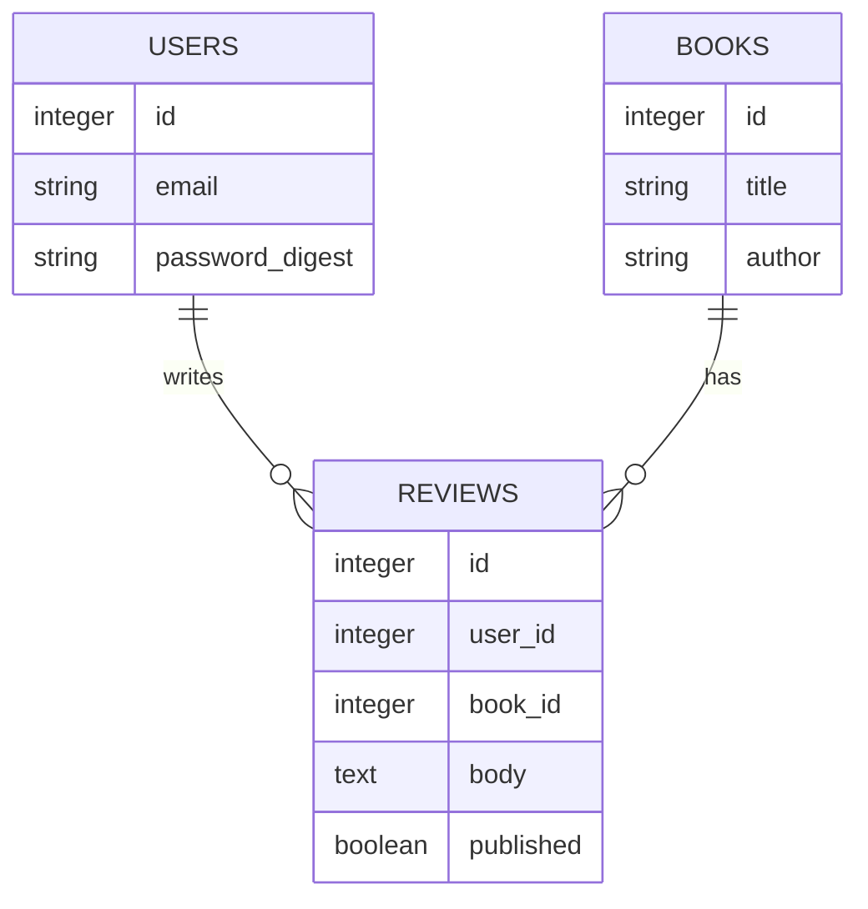

# 第26章 最終課題：要件からアプリを作り、発表する

> **この章のゴール**：自分で決めたテーマについて、要件定義・設計・Rails での実装・セキュリティ確認を一人で通しで行う。完成したアプリを、構造と設計判断を含めて他者に説明し、ルーブリックで評価・改善できるようになる。
> **目安時間**：読む 2時間 ＋ 演習 40〜60時間（2〜4週間）
> **前提**：第25章まで

## この章で学ぶこと

- ユーザーストーリーと受け入れ条件で、作るものの範囲を決められる
- ER図・画面一覧・ルーティング表・認可表で、実装前に設計できる
- Rails で、認証・認可・CRUD・バリデーション・テスト・CI を備えたアプリを作れる
- 第10章・第20章のチェックリストでセキュリティを確認し、残る不足を記録できる
- 作ったアプリの構造と設計判断を、スライドで他者に説明できる
- ルーブリックで自己評価・他者評価を行い、改善点を言葉にできる

## この課題の位置づけ

ここまでの章では、各章のテーマに沿って、決められた課題を解いてきました。
最終課題では、テーマ選びから発表まで、すべてを自分で決めます。
仕事に近い形で、これまでの知識を一つにつなげる練習です。

元教材 training-web-app の最終課題は、ゴールを次のように書いています。

> 「動くものを作った」状態から、「説明できる・評価できる」状態へ進むこと

この教材でも、同じゴールを目指します。
アプリが動くことは、出発点にすぎません。
「なぜその設計にしたのか」「何が守れていて、何が守れていないのか」を
自分の言葉で説明できることが、この課題の本当の目的です。

正直に言うと、この課題は大変です。
途中で、何度も「どう作ればいいか分からない」場面に出会います。
それは、これまでの章では誰かが決めてくれていた判断を、自分でするからです。
その迷いこそが、仕事で毎日していることです。
迷ったら、該当する章に戻り、第24章の作法どおり一つずつ Issue にして進めましょう。

## 全体の流れ

| ステップ | 内容 | 目安 | 主に使う章 |
|---|---|---|---|
| 1 | テーマを決める | 2時間 | この章 |
| 2 | 要件定義（ユーザーストーリー） | 3時間 | この章 |
| 3 | 設計（ER図・画面・ルーティング・認可） | 5時間 | 第15・18・19章 |
| 4 | 実装（認証・認可・CRUD・バリデーション・テスト・CI） | 25〜40時間 | 第18〜22章 |
| 5 | セキュリティ確認と不足の記録 | 4時間 | 第10・20章 |
| 6 | 発表の準備と発表 | 5時間 | この章 |
| 7 | 評価と改善 | 3時間 | この章 |

作業用のリポジトリは `~/workspace/final-project/` に作ります。
GitHub のリポジトリは、最初は非公開（Private）にします。
公開するかどうかは、ステップ5の確認が終わってから判断します。

## ステップ1：テーマを決める

### テーマの条件

次の条件を満たすテーマを選びます。

- ログインしたユーザーごとに、自分のデータを持つ（認証が必要）
- 他人のデータを、勝手に変更・削除できてはいけない（認可が必要）
- モデルが2つ以上あり、関連（1対多など）がある
- 作成・一覧・詳細・更新・削除（CRUD）がそろう
- 実在の個人情報やお金を扱わない（ダミーデータで成り立つ）

最後の条件は大事です。
決済や、実在の人の健康情報などを扱うアプリは、学習用には向きません。
守るべきものが重すぎて、学習の範囲では安全を保証できないからです。

### テーマ例

**例1：読書記録アプリ**
自分が読んだ本と感想を記録します。
ユーザー・本・感想（レビュー）のモデルがあります。
感想は「公開」「非公開」を選べ、公開の感想だけが他人にも見えます。
公開・非公開の切り替えが、認可の練習になります。

**例2：小さなチームのタスク管理**
チームを作り、メンバーを招待し、タスクを登録します。
ユーザー・チーム・メンバーシップ・タスクのモデルがあります。
「チームのメンバーだけがタスクを見られる」「作成者だけが削除できる」など、
認可のルールが複雑になります。難しめのテーマです。

**例3：勉強会の参加登録**
主催者が勉強会を作り、参加者が申し込みます。
ユーザー・イベント・参加登録のモデルがあります。
定員を超えたら申し込めない、主催者だけが編集できる、などのルールがあります。
定員のチェックは、バリデーションの良い練習です。

どのテーマも、まず「最小の形」で完成させることを目指します。
機能を足すのは、最小の形が動いてからです。

## ステップ2：要件定義

### 要件定義とは

**要件定義**とは、「何を作るか」「何を作らないか」を決めることです。
家を建てる前に、部屋の数や予算を決めるのと同じです。
ここを曖昧にすると、作りながら仕様が膨らみ、いつまでも終わりません。

### ユーザーストーリー

要件は、**ユーザーストーリー**の形で書きます。
使う人の立場で、「誰が・何をしたいか・なぜか」を1文で書く方法です。

```text
読書家として、読み終えた本の感想を記録したい。あとで読み返して思い出すためだ。
```

形にすると「〇〇として、〜したい。なぜなら〜だからだ」です。
「なぜなら」の部分が、第24章の Issue の「背景」と同じ役割をします。

### 受け入れ条件

各ストーリーに、**受け入れ条件**を付けます。
「これが満たされたら、このストーリーは完成」と判断する条件です。
第24章の完了条件と同じく、確かめられる形で書きます。

```text
ストーリー：読書家として、感想を非公開にしたい。他人に見られたくない感想もあるからだ。
受け入れ条件：
- 感想の作成・編集画面で「公開」「非公開」を選べる
- 非公開の感想は、本人以外の一覧・詳細に表示されない
- 本人以外が非公開の感想の URL を直接開くと、見つからない（404）扱いになる
```

3つ目の条件は、そのまま「攻撃が失敗するテスト」になります。
受け入れ条件を書くことは、テストを先に考えることでもあります。

### 優先順位を付ける

ストーリーを書き出したら、優先順位を付けます。

| 優先度 | 意味 |
|---|---|
| Must | これがないとアプリとして成り立たない。最初に作る |
| Should | あると良い。Must が終わってから作る |
| Could | 余裕があれば作る |

Must だけで動くものを、**MVP**（最小限の実用的な製品）と呼びます。
まず MVP を完成させ、発表できる状態にします。
Should 以降は、時間が残ったときの楽しみです。

「作らないもの」も書いておきます。
たとえば「画像のアップロードは作らない」「パスワード再設定メールは作らない」などです。
作らないと決めることで、範囲が守られます。

## ステップ3：設計

### ER図

**ER図**は、テーブルとその関係を表す図です（第15章）。
GitHub の Markdown では、Mermaid という書き方で図を描けます。
例1（読書記録）の例を示します。



テーブルごとに、カラム・型・制約（NOT NULL・一意など）を書き出します。
「どのカラムに、DB の制約とモデルのバリデーションの両方を付けるか」も決めます。
DB の制約は最後の砦、バリデーションは利用者への分かりやすいエラーのためです。

### 画面一覧と画面遷移

作る画面を表にします。手書きの絵でもかまいません。

| 画面 | URL | ログイン | 内容 |
|---|---|---|---|
| 公開感想の一覧 | /reviews | 不要 | 公開された感想の一覧 |
| 感想の詳細 | /reviews/:id | 不要（非公開は本人のみ） | 本・感想の本文 |
| 感想の作成 | /reviews/new | 必要 | 本を選び、本文と公開設定を入力 |
| マイページ | /my/reviews | 必要 | 自分の感想（非公開を含む） |

画面同士がどうつながるか（どのボタンでどこへ行くか）も、矢印で描いておきます。

### ルーティング表

画面一覧から、ルーティングを決めます（第14・18章）。

| メソッド | パス | コントローラ#アクション | 用途 |
|---|---|---|---|
| GET | /reviews | reviews#index | 一覧 |
| GET | /reviews/:id | reviews#show | 詳細 |
| GET | /reviews/new | reviews#new | 作成フォーム |
| POST | /reviews | reviews#create | 作成 |
| GET | /reviews/:id/edit | reviews#edit | 編集フォーム |
| PATCH | /reviews/:id | reviews#update | 更新 |
| DELETE | /reviews/:id | reviews#destroy | 削除 |

状態を変える操作は、必ず GET 以外にします。
GET で削除できると、リンクを踏ませるだけで削除させられるからです（第10章）。

### 認可表

最後に、「誰が、何に対して、何をできるか」を表にします。
これを**認可表**と呼ぶことにします。

| 操作 | 未ログイン | ログイン（他人） | 本人 |
|---|---|---|---|
| 公開感想を見る | できる | できる | できる |
| 非公開感想を見る | できない | できない | できる |
| 感想を作る | できない | できる（自分の分） | できる |
| 感想を編集・削除 | できない | できない | できる |

この表の「できない」のマスが、すべて「攻撃が失敗するテスト」の候補です。
表を先に作ると、認可のテストの漏れが減ります。

## ステップ4：実装

### 進め方

実装は、第24章の流れで進めます。
ステップ2・3の内容を Issue に分け、1 Issue ＝ 1ブランチ ＝ 1 PR で進めます。
一人でも PR を出し、セルフレビューしてからマージします。
TDD（RED → GREEN → REFACTOR）を基本にします。

おすすめの順番は次のとおりです。

1. `rails new` で作り、最初に CI を動かす（中身が空でも CI が緑になる状態）
2. 認証（ユーザー登録・ログイン・ログアウト）
3. 主なモデルとバリデーション（モデルのテストから）
4. CRUD（リクエストテストやシステムテストから）
5. 認可（認可表の「できない」をテストにしてから）
6. 画面の整理、Should の機能

CI を最初に作るのは、後から作ると、壊れたテストの山を一度に直すことになるからです。
最初から緑を保てば、壊した瞬間に気づけます。
Rails 7.2 以降の `rails new` は、CI の設定ファイルも生成します。
GitHub Actions 用の `.github/workflows/ci.yml` です。
生成された設定を読み、何をしているか説明できるようにしてから使います（第22章）。

### 必須要件

次の項目は、テーマにかかわらず必須です。

**機能**

- ユーザー登録・ログイン・ログアウト（`has_secure_password` などを使い、パスワードは平文で保存しない）
- 主なモデルの CRUD
- 認可：他人のデータを変更・削除できない。非公開のデータを見られない
- バリデーション：必須項目、長さ、形式、一意性など。エラーメッセージが画面に出る
- 検索または並び替え：利用者の入力を受けて一覧を絞り込む・並べ替える機能を1つ以上（SQLインジェクション対策を実際に確かめるため）

**テスト**

- モデルのテスト（バリデーション・関連・スコープ）
- リクエストまたはシステムのテスト（主な CRUD の流れ）
- 認可のテスト（認可表の「できない」のマスすべて）
- セキュリティのテスト（XSS・CSRF・SQLインジェクション。詳しくはステップ5）

**開発の作法**

- すべての変更が PR 経由でマージされている
- CI でテストが自動実行され、`main` が緑である
- `.gitignore` に `.env`・`config/master.key`・ログ・DB ファイルなどが入っている
- README に、アプリの概要とローカルでの起動手順がある

### つまずきやすい所

- **認可の書き忘れ**：`edit` には書いたが `update` には書き忘れた、がよくあります。`before_action` でまとめるか、`current_user.reviews.find` のように探す範囲を絞ると漏れにくくなります。
- **N+1**：一覧で、1件ごとに関連のクエリが走る問題です（第18章）。ログを見て、同じ形のクエリが並んでいたら疑います。
- **テストデータの作り方**：fixtures の関連の書き方で詰まりやすいです。第22章を見直します。
- **時間切れ**：Should の機能に手を出して、Must が終わらないことです。MVP を先に完成させます。

## ステップ5：セキュリティ確認

### チェックリストで確認する

第10章と第20章のチェックリストを使い、自分のアプリを確認します。
最低限、次の項目は、確認方法と結果を記録します。

| 項目 | 確認方法の例 | 記録すること |
|---|---|---|
| XSS | 本文に `<script>alert(1)</script>` を入れ、HTML として実行されないことをテスト | テスト名と結果 |
| CSRF | CSRF トークンなしの POST・PATCH・DELETE が拒否され、DB が変わらないことをテスト | テスト名と結果 |
| SQLインジェクション | 検索や並び替えに `' OR '1'='1` などを入れても条件が変わらないことをテスト。動的なカラム名は許可リストで制限 | テスト名と結果 |
| パストラバーサル | ファイルの配信・一覧の機能がある場合のみ。公開ルートの外を読めないことをテスト | テスト名と結果、または「該当機能なし」 |
| 認可 | 認可表の「できない」のマスすべてをテスト | テスト名と結果 |
| 秘密情報 | `git ls-files` と `git log -p` に鍵・トークン・`.env` がない | 実行したコマンドと結果 |
| 依存関係 | 第20章の手順で、既知の脆弱性がある gem を確認（`brakeman` や `bundler-audit` など） | 実行結果と対応 |
| エラー表示 | 本番相当の設定で、エラー画面に内部情報が出ない | 確認方法 |

Rails のテスト環境では、CSRF の確認が標準で無効になっています。
CSRF のテストでは、そのテストの中だけ確認を有効にする必要があります（第19・20章）。
「テストが通ったのは、確認が無効だったからだった」ということがないよう注意します。

秘密情報の確認には、たとえば次のコマンドを使います。

```bash
git ls-files -- '*.pem' '*.key' '.env*' 'config/master.key'
```

何も表示されなければ、これらのファイルは Git の管理下にありません。
過去のコミットに含まれていないかも、`git log --all --stat` などで確認します。

### 防御の不足を記録する

テストがすべて通っても、それは「確かめた範囲で問題がない」という意味にすぎません。
本番で安全に運用できることの保証ではありません。

副教材「安全上の注意」で使った記録表を、Rails アプリ向けにして使います。
自分のアプリで、各領域が「実装済み」「一部」「未実装」「未確認」のどれかを書きます。
確かめていないものを「実装済み」にしないでください。

| 領域 | 放置すると起きること | 状態 | 根拠（コード・テスト・設定） |
|---|---|---|---|
| 資源の上限（リクエストの大きさ、アップロード、一覧の件数） | 巨大な入力や大量のデータで遅くなる・落ちる | 未確認 | |
| ログイン試行の制限 | パスワードを総当たりで試される | 未確認 | |
| セッション管理（有効期限、ログアウト時の破棄） | 盗まれたセッションが使われ続ける | 未確認 | |
| ログ・エラー応答（パスワードなどのフィルタ、詳細エラーの非表示） | ログやエラー画面から機密が漏れる | 未確認 | |
| 依存の更新 | 既知の脆弱性がある gem を使い続ける | 未確認 | |
| その他、自分のテーマ特有のもの | （自分で考える） | 未確認 | |

Rails は、エスケープや CSRF 対策など、多くの防御を標準で引き受けています。
第14章で自作したフレームワークと比べると、その量がよく分かります。
しかし、ログイン試行の制限のように、自分で入れないと存在しない防御もあります。
「Rails を使っているから安全」と考えず、自分で一つずつ確認します。

### デモ環境：ローカルで行う

最終デモは、自分の PC のループバックで行います。

```bash
bin/rails server -b 127.0.0.1
```

起動したら、別のターミナルで待ち受け先を確認します。

```bash
lsof -nP -iTCP:3000 -sTCP:LISTEN
```

`127.0.0.1:3000` だけが表示されることを確かめます。
`*:3000` や `0.0.0.0:3000` が表示されたら、すぐに止めて設定を見直します。
デモには、ダミーデータ（`db/seeds.rb` で作る架空のユーザーや本）を使います。
他の人に見せる場合は、画面共有か録画を使います。
公開トンネルやポート転送は使いません。

### デプロイする場合の条件

第23章で学んだデプロイを、最終課題で試したい人もいるでしょう。
次の条件をすべて満たす場合に限り、デプロイしてよいことにします。

- デプロイするのは、Rails で作った最終課題のアプリだけ（第11〜17章の自作サーバ・自作フレームワークは絶対に公開しない）
- ステップ5の必須項目（XSS・CSRF・SQLインジェクション・認可のテスト）がすべて通り、CI が緑
- 秘密情報は環境変数や credentials で管理し、リポジトリに含まれていない
- 本番環境でも、ダミーデータだけを使う。登録画面に「学習用。実在の情報を入力しないでください」と表示する
- 第23章の手順で、ログとエラーを確認できる
- 防御の不足の記録表を埋め、残るリスクを理解したうえで、公開期間と停止の手順を決めている
- 講師や先輩などにレビューしてもらえる場合は、事前に確認を受けている

一つでも満たさない場合は、ローカルでのデモにします。
ローカルでのデモでも、評価が下がることはありません。

## ステップ6：発表

### 発表の目的

発表の目的は、「作ったもの」を見せることではありません。
「どう考えて作ったか」を伝えることです。
聞く人が、あなたのアプリの構造と判断を理解できれば成功です。

### スライド構成

元教材の構成を、Rails の最終課題向けに整えたものです。
1枚あたり1分前後、全体で15〜20分を目安にします。

| 番号 | タイトル | 内容 |
|---|---|---|
| 1 | タイトル | アプリ名、自分の名前（公開版ではハンドルネーム） |
| 2 | 作ったものの概要 | 誰の、どんな困りごとを解決するか。主なユーザーストーリー |
| 3 | デモ（重要） | ループバックとダミーデータで、一覧・作成・更新・削除。認可で弾かれる様子も |
| 4 | 全体アーキテクチャ | HTTP → Router → Controller → Model → DB、Controller → View の図 |
| 5 | リクエストの流れ | 1つのリクエストを例に、どこを通り、どこで何が起きるか |
| 6 | 各レイヤーの責務 | Router・Controller・Model・View の役割と「なぜ分けるのか」 |
| 7 | データ設計 | ER図。Active Record と、第16章で自作した ORM との対応 |
| 8 | バリデーションと認可の設計 | どこでチェックしているか。なぜそこに置いたか。認可表 |
| 9 | 設計判断 | どこを共通化したか、しなかったか。その理由と別案 |
| 10 | 自作との比較 | 第14・16・17章の自作部品と Rails の同じ点・違う点・なぜ違うか |
| 11 | テストと CI | 何をどの層でテストしたか。CI の構成 |
| 12 | セキュリティ | 4つの攻撃への対策とテスト結果。防御の不足の記録表 |
| 13 | 苦労したポイント | 設計で悩んだ点、実装で詰まった点と、どう抜け出したか |
| 14 | 学んだこと（最重要） | 一番重要な理解、認識が変わったこと |
| 15 | 今後の改善 | 追加したい機能、残る不足とその影響 |

スライド3のデモは、失敗に備えて録画も用意しておくと安心です。
録画やスクリーンショットに、他のタブ、通知、ターミナルの環境変数が映っていないか確認します。

スライド12では、「テストがすべて通っても、本番で安全とは限らない」ことを、
自分のアプリの記録表を使って説明してください。

### 説明の練習

発表の前に、一度声に出して通しで練習します。
特にスライド5と9は、質問されやすい所です。
「なぜですか？」と3回続けて聞かれても答えられるか、自分に問いかけてみます。

## ステップ7：評価

### 評価基準

元教材と同じ4段階で評価します。

| 段階 | 状態 |
|---|---|
| S（優れている） | 深い理解がある。設計の意図を説明できる。トレードオフを語れる。抽象化の判断が適切 |
| A（良い） | 基本的な理解がある。構造を説明できる。実装に一貫性がある |
| B（標準） | 動作するものは作れている。一部説明が曖昧 |
| C（要改善） | 理解が浅い。説明できない。レイヤーが混ざっている |

### 評価項目

各項目を S / A / B / C で評価します。

| 項目 | 観点 |
|---|---|
| 1. 技術理解 | HTTP・Router・Controller・Model・View の理解。Rails が裏で何をしているか |
| 2. 設計力 | 責務分離、データ設計、抽象化の適切さ |
| 3. 実装品質 | 一貫性、読みやすさ、命名 |
| 4. テスト | 層ごとのテスト、境界値、認可と攻撃のテスト、CI |
| 5. セキュリティ | 必須の対策、記録表の正確さ、残るリスクの理解 |
| 6. チーム開発の作法 | Issue・PR・コミットの粒度、セルフレビューの跡 |
| 7. 説明能力 | 他者に伝えられるか。質問に答えられるか |
| 8. トレードオフ理解 | なぜその設計にしたか。別案と比べて説明できるか |

### 安全上の必須評価

次の項目は、S〜C の評価にかかわらず必須です。
満たさない場合は、提出を完了とせず、修正して再確認します。

- [ ] 自作サーバ・自作フレームワークを外部公開していない。デプロイした場合は、本章の条件をすべて満たしている
- [ ] デモの待ち受け先がループバックに限定されていることを、`lsof` の出力で示せる
- [ ] 秘密鍵・トークン・`config/master.key` を共有・コミットしていない
- [ ] XSS・CSRF・SQLインジェクション・認可のテスト結果を示せる。ファイル配信がある場合はパストラバーサルも
- [ ] 防御の不足の記録表を埋め、未実装の防御とその影響を具体的に説明できる
- [ ] ダミーデータだけを使っている

### 自己評価コメント

次の3つを必ず書きます。

- **強み**：この課題で、自分がよくできたこと
- **弱み**：説明が曖昧だった所、理解が浅いと感じた所
- **改善したい点**：次に何をすれば、一段上の評価になるか

評価は甘くも辛くもせず、根拠を添えて書きます。
「A：認可表の全マスにテストがあり、CI で確認している（テスト名を列挙）」のようにです。

### 他者評価（相互レビュー）

仲間がいる場合は、お互いの発表とリポジトリをレビューします。
次のチェックリストを使います。

- [ ] 全体構造：レイヤーが分離され、アーキテクチャが明確
- [ ] 責務：各レイヤーの役割を説明でき、責務が混ざっていない
- [ ] データ：ER図とモデルが一致し、DB との関係を説明できている
- [ ] 抽象化：適切に共通化され、過剰設計ではない
- [ ] テスト：認可と攻撃のテストがあり、CI が緑
- [ ] 説明力：話が論理的で、初見でも理解できる
- [ ] トレードオフ：設計の理由と、別案との比較がある
- [ ] デモ：正常に動作し、ユースケースが明確
- [ ] 安全上の境界：ループバックとダミーデータでデモし、残る不足を説明できている

フィードバックには、次の3つを必ず書きます。

- **良かった点**：具体的に（「認可表をスライドに載せていて、テストとの対応が分かりやすかった」）
- **改善点**：具体的に。第24章のレビューの言い方を使う
- **質問**：相手の理解を深めるための問い（「`published` をモデルのスコープにした理由は？」）

### 一人で取り組む場合

相互レビューの相手がいない場合は、次の方法で代わりにします。

1. 発表を録画し、1日以上空けてから、上のチェックリストで自分をレビューする
2. 第25章のルールに沿って、AI に「レビュアーとして質問だけを出して」と頼み、その質問に答える
3. 代わりに行ったこと、確認の根拠、確認できなかった項目を、提出物に記録する

確認できなかった項目を正直に書くことは、評価を下げることではありません。
むしろ、自分の確認の範囲を把握していることの証拠になります。

## 提出物

次をリポジトリにまとめます。

| 提出物 | 置き場所の例 |
|---|---|
| アプリのコード | リポジトリ本体 |
| 要件定義（ユーザーストーリー・受け入れ条件・作らないもの） | `docs/requirements.md` |
| 設計（ER図・画面一覧・ルーティング表・認可表） | `docs/design.md` |
| セキュリティ確認の記録と防御の不足の記録表 | `docs/security.md` |
| 発表スライド | `docs/slides.pdf` など |
| 自己評価（ルーブリックと自己評価コメント） | `docs/self-review.md` |
| 他者評価、または一人の場合の代替記録 | `docs/peer-review.md` |

リポジトリを公開したり、資料を共有したりする前に、第10章の「成果物を共有する前のチェックリスト」を必ず実行します。
コードだけでなく、Git の履歴、DB、ログ、スクリーンショット、録画、スライドも見直します。

## 実務ではこうなる

現場の開発も、この課題と同じ流れです。
企画やお客さんの要望からユーザーストーリーを作り、設計し、Issue に分け、PR で積み上げます。
違いは、要件定義や設計を、チームで議論しながら行うことです。

ジュニアが最初に任されるのは、ステップ4の一部、つまり「設計済みの Issue の実装」です。
しかし、ステップ2・3を一度でも自分でやった経験があると、Issue の背景が読めるようになります。
「この受け入れ条件は、たぶんこういう心配から来ている」と分かると、判断がずれにくくなります。

ジュニアがやりがちな失敗を挙げます。

- **設計せずに書き始める**：途中でテーブル構成を変えることになり、マイグレーションとテストを大量に直す。
- **認可を最後に回す**：全画面ができてから認可を入れ、漏れが大量に見つかる。
- **Must が終わる前に Should に手を出す**：発表の日に、基本の削除機能が動かない。
- **「テストが通ったので安全です」と言う**：確かめた範囲と、確かめていない範囲を区別できていない。
- **発表で機能紹介だけをする**：「何ができるか」は話せても、「なぜそう作ったか」を話せない。

## 演習

最終課題そのものが演習です。
4つのまとまりに分けて、完了条件を示します。

### 演習26-1：テーマと要件定義

- テーマを決め、`~/workspace/final-project/` で `rails new` を行う。非公開の GitHub リポジトリを作って push する。
- `docs/requirements.md` に、ユーザーストーリーを Must 5個以上、Should・Could を合わせて3個以上書く。
- すべての Must に、確かめられる形の受け入れ条件を付ける。
- 「作らないもの」を3つ以上書く。
- **完了条件**：`docs/requirements.md` に上記がそろっている。Must のストーリーがそれぞれ GitHub の Issue になり、本文にストーリーと受け入れ条件がある。
- ヒント：受け入れ条件の中に、「本人以外は〜できない」の形の条件が少なくとも2つあると、認可の設計につながります。

### 演習26-2：設計

- `docs/design.md` に、ER図（Mermaid またはテキスト）、画面一覧、ルーティング表、認可表を書く。
- ER図には、カラムの型と、NOT NULL・一意などの制約を書く。
- 認可表の「できない」のマスを数え、その数だけ認可テストの Issue（またはチェックリスト）を作る。
- **完了条件**：4種類の設計がそろっている。認可表の「できない」のマスの数と、認可テストの予定数が一致している。
- ヒント：ルーティング表を書いたら、`bin/rails routes` の出力と見比べられるよう、メソッド・パス・アクションの3列は必ず入れておきます。

### 演習26-3：実装

- CI を最初に動かし、以降はすべて PR 経由で進める。
- 必須要件（機能・テスト・開発の作法）をすべて満たす。
- TDD で進め、少なくとも認可とバリデーションの PR では、テストを先にコミットする。
- **完了条件**：`bin/rails test`（システムテストを使う場合は `bin/rails test:system` も）がすべて成功する。`main` の CI が緑。マージ済みの PR が5つ以上あり、それぞれに説明とセルフレビューの跡（自分の行コメントなど）がある。認可表の「できない」のマスすべてに対応するテストがある。
- ヒント：詰まったら、第24章の15〜30分ルールを自分に当てはめ、調べたことを Issue のコメントに記録してから、AI や仲間に「質問の型」で聞きます。

### 演習26-4：セキュリティ確認・発表・評価

- `docs/security.md` に、ステップ5の確認表と防御の不足の記録表を埋める。
- `bin/rails server -b 127.0.0.1` で起動し、`lsof` の出力を `docs/security.md` に貼る。
- スライドを作り、録画または仲間の前で発表する。
- ルーブリックで自己評価し、他者評価（または一人の場合の代替）を行う。
- 評価で見つかった改善点から1つ以上を選び、Issue と PR で実際に改善する。
- **完了条件**：安全上の必須評価の全項目にチェックが入り、それぞれに根拠（テスト名・コマンドの出力・ファイルの場所）がある。提出物の表のファイルがすべてそろっている。評価後の改善 PR が1つ以上マージされている。

## 確認クイズ

**Q1**：ユーザーストーリーの「なぜなら〜」の部分は、何の役に立ちますか。

**Q2**：認可表を実装前に作ると、どんな良いことがありますか。

**Q3**：CI を開発の最初に作る理由を説明してください。

**Q4**：「テストがすべて通ったので、このアプリは本番で安全です」という発言の問題点を説明してください。

**Q5**：発表で、機能の紹介だけでは不十分な理由を説明してください。

### 解答と解説

**A1**：作る人が目的を理解でき、仕様に書かれていない細かい判断を、目的に合わせてできるようになります。第24章の Issue の「背景」と同じ役割です。

**A2**：「できない」のマスが、そのまま認可テストの一覧になります。実装前にテストの漏れを防げ、`edit` には書いたが `update` には書き忘れた、のような穴を見つけやすくなります。

**A3**：最初から緑の状態を保てば、壊した瞬間に気づけるからです。後から作ると、どこで壊れたか分からないテストの失敗を、まとめて直すことになります。

**A4**：テストは「確かめた範囲で問題がない」ことしか示しません。ログイン試行の制限、資源の上限、セッション管理など、テストしていない防御が残っています。記録表で確かめた範囲と確かめていない範囲を区別して説明する必要があります。

**A5**：この課題の目的は「説明できる・評価できる」状態になることだからです。聞く人が知りたいのは、構造と設計判断、そしてその理由です。仕事でも、レビューや障害対応では「なぜそう作ったか」が問われます。

## AIの使い方（この章）

推奨する聞き方の例：

- 「読書記録アプリのユーザーストーリーを書きました。受け入れ条件が曖昧な所、テストにしにくい所を指摘してください。書き直しはしないでください」
- 「この認可表に、抜けている操作や立場はありますか？ 問いの形で教えてください」
- 「発表の練習をします。あなたはレビュアーとして、私のアプリの設計について『なぜ』を3回掘り下げる質問をしてください」

この章でやってはいけない使い方：

- コントローラ・モデル・テストなどの実装を AI に生成させ、そのまま使うこと。最終課題は、自分が説明できることを示す場です。
- 自己評価や発表原稿を AI に書かせること。自分の言葉で書けないことは、まだ理解が足りない所です。そこを見つけることが評価の目的です。

## まとめ

最終課題では、要件定義から発表まで、すべての判断を自分で行いました。
ユーザーストーリーと受け入れ条件で範囲を決め、ER図・ルーティング表・認可表で設計してから実装します。
テストが通っても、確かめた範囲を超えた安全は保証されません。記録表で不足を言葉にします。
「動くものを作った」から「説明できる・評価できる」へ進むことが、この課題のゴールです。

## 用語

| 用語 | 意味 |
|---|---|
| 要件定義 | 何を作り、何を作らないかを決めること |
| ユーザーストーリー | 「〇〇として、〜したい。なぜなら〜」の形で書く要件 |
| 受け入れ条件 | ストーリーが完成したと判断するための、確かめられる条件 |
| MVP | 最小限の実用的な製品。Must の機能だけで動くもの |
| Must / Should / Could | 優先度の区分。必須・あると良い・余裕があれば |
| ER図 | テーブルとその関係を表す図 |
| Mermaid | テキストで図を書く記法。GitHub の Markdown で表示できる |
| 画面一覧 | 作る画面と、その URL・内容をまとめた表 |
| ルーティング表 | HTTP メソッド・パス・アクションの対応表 |
| 認可表 | 誰が、何に対して、何をできるかをまとめた表 |
| ルーブリック | 評価の観点と段階を表にした評価基準 |
| 相互レビュー | 学習者同士で成果物と発表を評価し合うこと |

---
[← 前の章](./25-ai-era-engineering.md) | [目次](../README.md) | [次の章 →](./27-job-ready-checklist.md)
